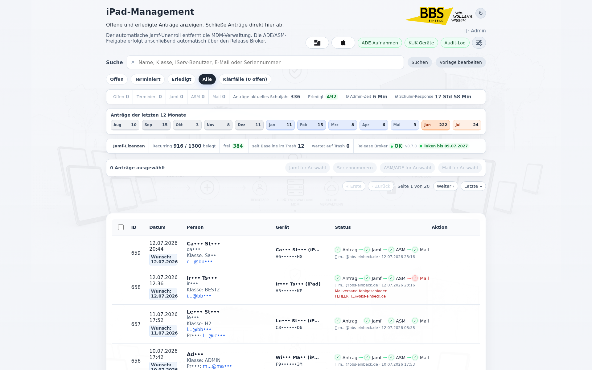
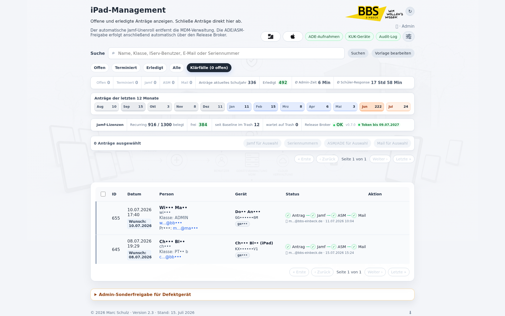
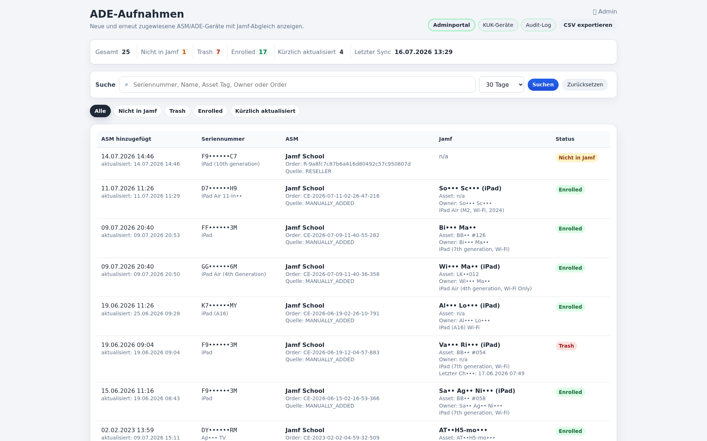
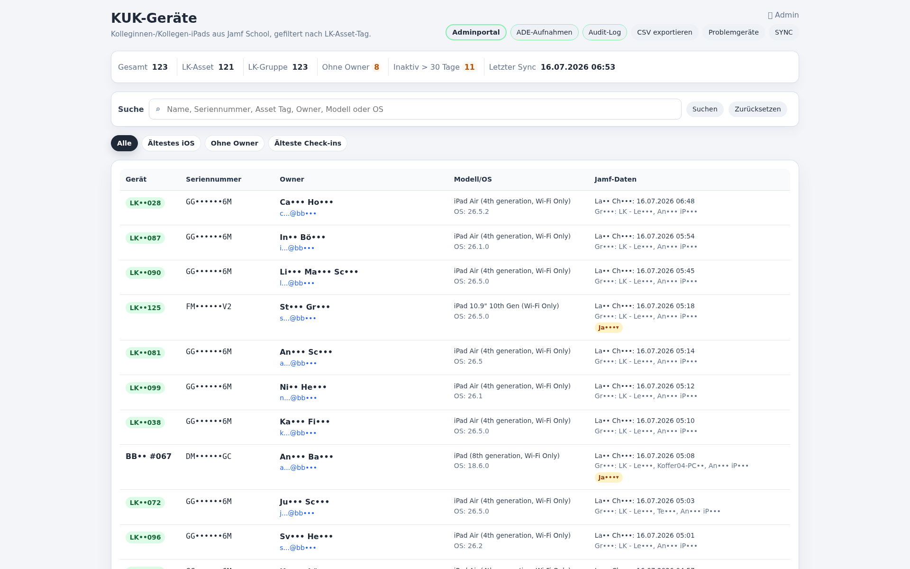
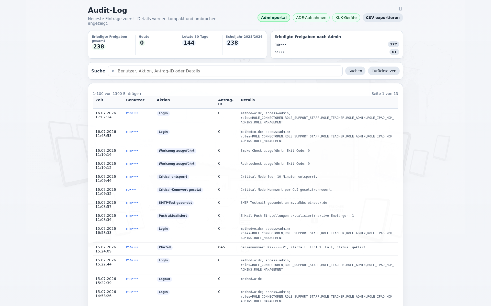
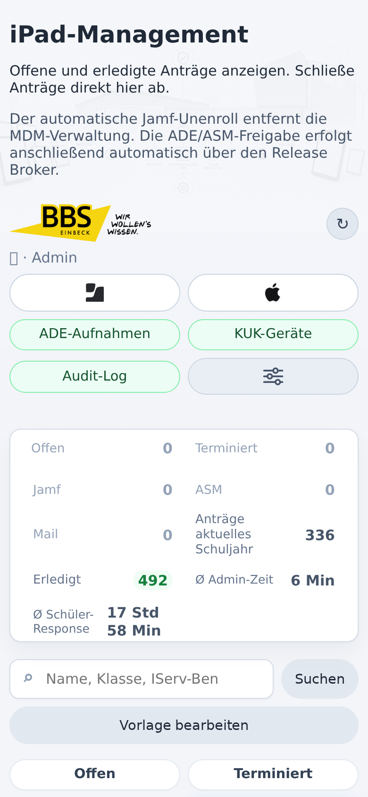
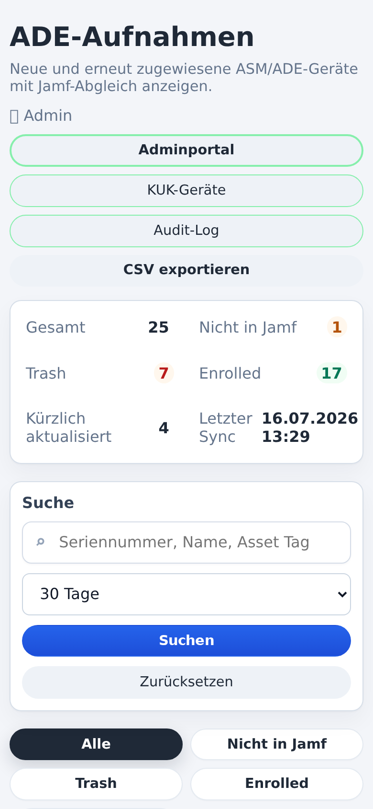
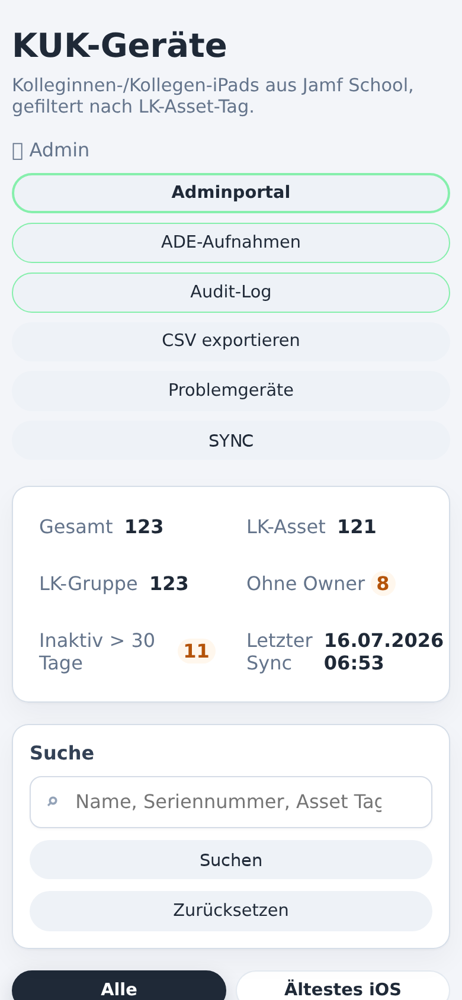

# BBS Einbeck iPad-Management

[English version](README.en.md)

Webanwendung fuer die Rueckgabe und Freigabe ehemaliger Schueler-iPads der BBS Einbeck. Version 2.4 ergänzt ein Einstellungsportal mit Critical Mode und eng begrenztem Root-Helper; seit Version 2.0 automatisiert DISOWN den Ablauf bis zur Apple-ADE/ASM-Freigabe ueber einen lokalen Release Broker.

## Stand

- Version: `2.4`
- Datum: `16. Juli 2026`
- Produktionspfad: `/var/www/sicher.bbs-einbeck.de/disown`
- Entwicklungszweig: `/var/www/sicher.bbs-einbeck.de/disown-dev`
- Public-Demo: neutralisierte Variante ohne Zugangsdaten und ohne lokale Projekt-State-Dateien

## Funktionsumfang

- Self-Service-Webclip fuer Rueckgabeantraege.
- Schutzseite fuer schulische Leih-/Koffergeraete, damit diese nicht versehentlich freigegeben werden.
- Adminportal mit beruhigter Auto-Suche, Statusfiltern, Bulk-Verarbeitung, Kennzahlen, Jahresverlauf und Jamf-Lizenztrend.
- Admin-Sonderfreigabe fuer defekte Geraete per Seriennummer, mit bewusster Einzelfall-Pruefung und ohne Bulk/WebClip-Bypass.
- Release-Broker-Status inklusive ADE-Token-Ablauf im Admin-Dashboard.
- Automatischer Jamf-Unenroll per Jamf-School-API.
- Automatische ASM/ADE-Freigabe per Apple School Manager Public API und lokalem NanoDEP Release Broker.
- Abschlussmail an schulische und private E-Mail-Adresse; der Prozess wird auch bei Teilfehlern abgeschlossen und der Mailstatus wird rot markiert.
- Klärfall-Notizen zu einzelnen Geraeten, lokal in der Datenbank.
- KUK-Geraeteuebersicht fuer Kolleginnen-/Kollegen-iPads aus Jamf School.
- ADE-Aufnahmen mit Abgleich zwischen ASM/ADE und Jamf School.
- Audit-Log mit Dashboard, Export und protokollierten Bulk-Seriennummernlisten.
- DEV-Modus mit Demo-Daten und Dry-Run fuer Jamf, ASM/ADE und Mail.

## Screenshots

## Mobile Screenshots

  
  
  

## Standardablauf

1. Schuelerin oder Schueler stellt den Antrag ueber den Webclip.
2. Admin fuehrt den Jamf-Unenroll aus.
3. Das System weist genau dieses Geraet per ASM Public API dem Release Broker zu.
4. Der lokale NanoDEP Release Broker fuehrt den ADE/DEP-Disown aus.
5. Das System kontrolliert, dass das Geraet danach fuer den Broker nicht mehr erreichbar ist.
6. Abschlussmail wird an alle vorhandenen Empfaengeradressen gesendet.
7. Der Antrag ist erledigt; Teilerfolge und Fehler stehen im Audit-Log.

Die alte Spalte `asm_manual_done` bleibt aus Kompatibilitaetsgruenden bestehen, bedeutet seit Version 2.0 aber: ASM/ADE-Freigabe wurde erledigt, in der Regel automatisch.

## Admin-Sonderfreigabe

Der seltene Sonderweg fuer defekte Geraete liegt im Adminportal unten vor dem Footer. Admins pruefen zuerst die Seriennummer gegen Jamf, kontrollieren Name und E-Mail-Adressen und legen danach nur einen lokalen Antrag an. Jamf-Unenroll, ASM/ADE-Freigabe und Mail laufen anschliessend ueber die normale Tabellenzeile.

Nur dieser Admin-Sonderweg darf den Schulgeraete-Blocker bewusst ueberspringen. WebClip, normale Antraege und Bulk bleiben gegen schulische Leih-/Koffergeraete geschuetzt.

## Bulk-Workflow

Der Bulk-Ablauf bleibt bewusst schrittweise:

1. Antraege markieren.
2. `Jamf fuer Auswahl` ausfuehren.
3. Seriennummernliste wird kopierbar angezeigt und im Audit-Log protokolliert.
4. `ASM/ADE fuer Auswahl` automatisiert die Apple-Freigabe ueber den Release Broker.
5. `Mail fuer Auswahl` sendet die vorbereiteten Abschlussmails.

Die Auswahl bleibt bis zum Mail-Schritt erhalten. Erst nach dem Mailversand wird automatisch abgewählt. Das verhindert, dass Admins nach dem Jamf-Schritt Seriennummern oder Empfaenger vergessen.

## ASM/ADE Release Broker

Seit Version 2.0 nutzt DISOWN zwei getrennte Apple-Wege:

- Apple School Manager Public API: weist ein einzelnes Geraet dem Release-Broker-MDM-Dienst zu.
- Apple ADE/DEP API ueber NanoDEP: fuehrt danach `disown` fuer dieses Geraet aus.

Wichtig:

- Die Freigabe aus der Apple-Organisation ist irreversibel.
- Der Broker lauscht nur lokal auf `127.0.0.1:9001`.
- Secrets liegen ausserhalb des Webroots unter `/srv/disown-protected/asm-release-broker` und `/etc/disown`.
- DEV fuehrt nur Dry-Runs aus.

Die Beispielkonfiguration liegt unter:

- `config/asm-release-broker.example.conf`

Der Installationshelfer fuer den lokalen NanoDEP-Dienst liegt unter:

- `tools/install-nanodep-service.sh`

## Installation und Betrieb

Siehe:

- [Deutsch: docs/INSTALL.md](docs/INSTALL.md)
- [English: docs/INSTALL.en.md](docs/INSTALL.en.md)
- [Secrets und Runtime-Dateien: docs/SECRETS.md](docs/SECRETS.md)

Kurzfassung:

1. PHP/MySQL/Apache bereitstellen.
2. Datenbank und Tabellen anlegen.
3. Jamf-School-API konfigurieren.
4. Apple School Manager API Account konfigurieren.
5. Release Broker in ASM anlegen, Release erlauben und Token fuer NanoDEP importieren.
6. `tools/install-nanodep-service.sh` ausfuehren.
7. DEV Dry-Run und ein einzelnes PROD-Testgeraet pruefen.

## Wichtige Dateien

- `index.php` - Webclip und Antragserfassung.
- `admin.php` - Adminportal, Bulk-Workflow, Mail, Dashboard.
- `asm_release.php` - ASM/ADE-Freigabe ueber Release Broker.
- `jamf.php` - Jamf-School-Anbindung und Geraeteschutz.
- `ade.php` - ADE-Aufnahmen.
- `kuk/index.php` - KUK-Geraete.
- `audit_log.php` - Audit-Log und Auswertungen.
- `settings.php` - Betriebs-, Mail-, Job-, Sicherheits- und System-Einstellungen.
- `config/asm-release-broker.example.conf` - Beispiel fuer Broker-Konfiguration.
- `tools/install-nanodep-service.sh` - systemd-Installation des NanoDEP-Servers.
- `tools/install-nanodep-monitoring.sh` - Healthcheck-Timer und Logrotation fuer NanoDEP.
- `tools/install-settings-root-helper.sh` - Installation des eng begrenzten Root-Helpers fuer Critical Mode.
- `docs/SECRETS.md` - Ablageplan fuer Runtime-Secrets, Broker-Token und Logs.
- `docs/RELEASE.md` - Release-Checkliste mit Backup-, Smoke- und Public-Pruefung.
- `scripts/smoke_check.php` - read-only Smoke-Check fuer Deployments.

## Sicherheit

- Keine Secrets im Repository.
- Runtime-Konfiguration unter `/etc/disown`.
- Geschuetzte Token/Keys unter `/srv/disown-protected`.
- Public-Repository ist neutralisiert.
- Schreibende Aktionen sind Admin-only.
- KUK-Seite ist read-only gegen Jamf.
- Alle kritischen Aktionen werden auditiert.
- Critical Mode ist zeitlich begrenzt; der Root-Helper erlaubt nur fest definierte Kommandos.

## Historie

- `2.4`: Einstellungsportal mit E-Mail-Push-, SMTP-, Job-, Sicherheits- und Systembereichen; Critical Mode schützt Root-Helper-Aktionen mit separatem Kennwort, kurzer Laufzeit und Audit-Log.
- `2.4` Nachpflege: Vollständig unbearbeitete Fehlanträge können mit Bestätigung im Adminportal gelöscht werden; die Löschung bleibt im Audit-Log dokumentiert.
- `2.4` Nachpflege: Backup-Status und neue Code-/DB-Sicherungen sind über Critical Mode und den fest begrenzten Root-Helper im Einstellungsportal verfügbar.
- `2.3`: Schaltbarer E-Mail-Push fuer neue WebClip-Antraege; Adminportal speichert den Ein/Aus-Zustand in `app_settings`, Empfaenger bleiben in `/etc/disown/notify.conf`.
- `2.2`: Visuelles Release mit polierter Admin-Tabelle, ausgewaehlten Zeilen, deutlicheren Aktionen und vereinheitlichtem Look fuer Admin, ADE-Aufnahmen, Audit-Log und KUK.
- `2.1`: UI-Struktur modernisiert; Admin-, ADE-, Audit- und KUK-Styles/Skripte liegen in `assets/`, Suche reagiert ruhiger und behaelt nach Auto-Aktualisierung den Fokus.
- `2.0`: automatische ASM/ADE-Freigabe ueber Release Broker, NanoDEP-Dienst, verbesserter Bulk-Workflow, Mail an beide Adressen mit Teilerfolg, neue Doku und Screenshots.
- `2.0` Nachpflege 2026-07-10: Admin-Sonderfreigabe fuer defekte Geraete, ADE-Token-Hinweis, Mail-Dialog-Korrektur und Wartehinweis fuer Einzelaktionen.
- `1.9`: UI-Vereinheitlichung, Monatsuebersicht, Klärfaelle, Jamf-Lizenzindikator.
- `1.8`: KUK-Geraete, ADE-Aufnahmen, Audit-Dashboard.
