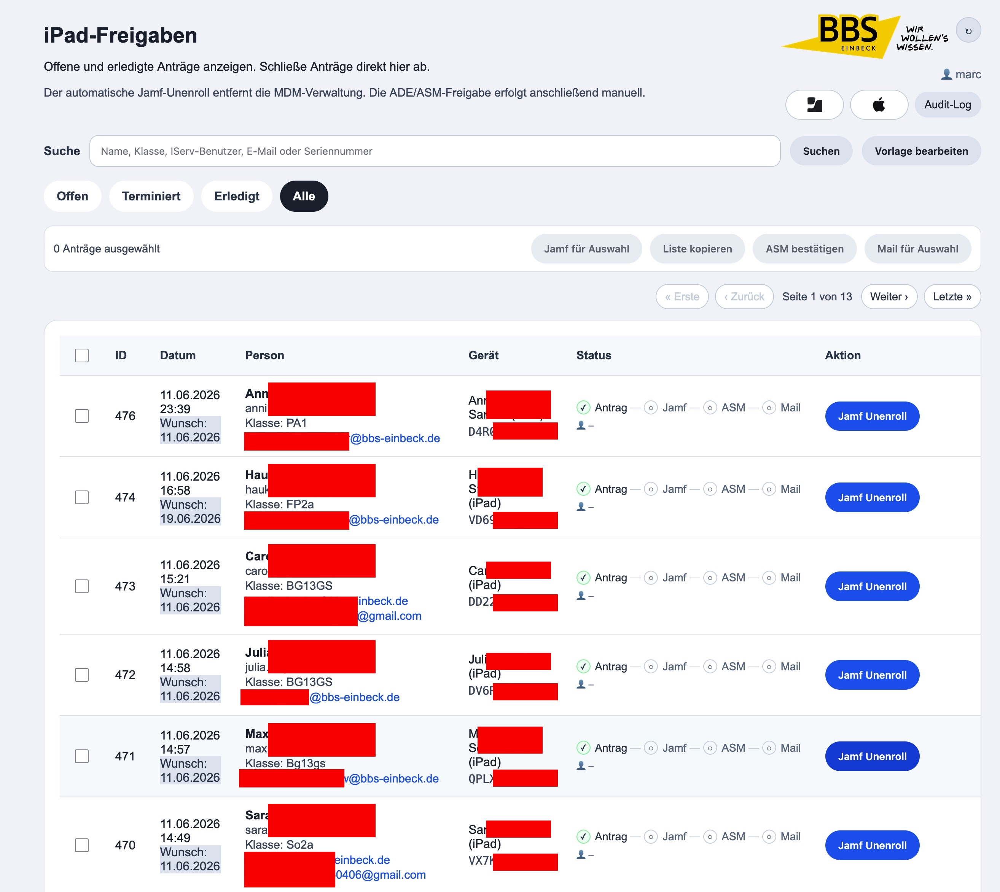
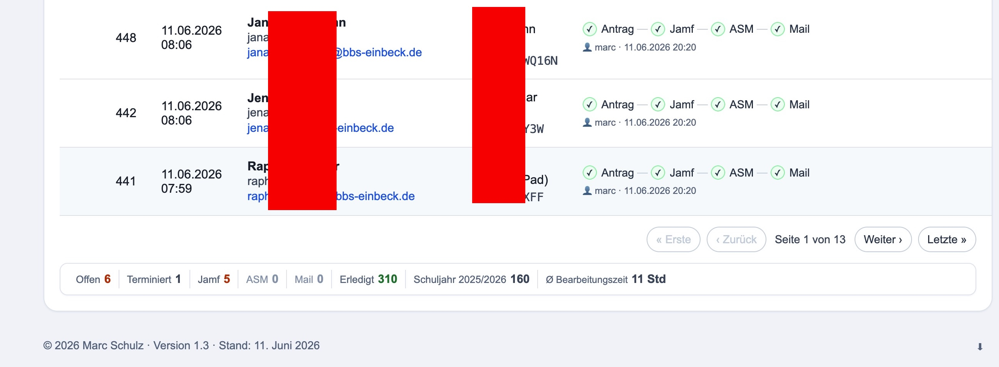

# BBS MDM Disown

[English README](README.en.md)

Webanwendung der BBS Einbeck zur Freigabe schulisch verwalteter iPads aus Jamf und Apple School Manager.

Die Anwendung bildet den lokalen Verwaltungsprozess ab: Schuelerinnen und Schueler stellen ueber einen iPad-Webclip einen Antrag, das MDM-Team bearbeitet die Freigabe im Adminportal und dokumentiert die Schritte nachvollziehbar.

## Screenshots

### Schueler-Webclip


### Adminportal





## Funktionsumfang

- Antrag per Seriennummer aus dem iPad-Webclip
- Jamf-Abfrage anhand der Seriennummer
- Warnhinweis mit Pflichtbestaetigung vor Antragstellung
- Pflichtfeld fuer Klasse, maximal sechs Zeichen
- optionales privates E-Mail-Feld
- Wunschdatum fuer die Freigabe, keine Auswahl in der Vergangenheit
- Duplikatschutz fuer offene Antraege je Seriennummer
- Adminportal mit Suche, Filtern und Prozessanzeige
- Workflow: Antrag -> Jamf -> ASM -> Mail -> Erledigt
- Jamf-Unenroll ueber API
- manuelle ASM/ADE-Bestaetigung
- Mailvorschau mit editierbarem Empfaenger, Betreff und Nachricht
- Versand an schulische und/oder private E-Mail-Adresse
- Bulk-Verarbeitung fuer Jamf, ASM und Mail
- ASM-Seriennummernliste zum Kopieren
- Filter fuer offene, erledigte und terminierte Antraege
- Audit-Log mit CSV-Export
- Admin-Benachrichtigung per Cron fuer faellige und terminierte Antraege
- DEV-Modus fuer Tests ohne echte Jamf- und Mail-Auswirkungen

## Produktivsystem

Produktivpfad:

```text
/var/www/example.org/disown
```

Produktiv-URL:

```text
https://example.org/disown/
```

Wichtige Pfade:

```text
/disown/          Antrag/Webclip
/disown/admin    Adminportal
/disown/audit    Audit-Log
/disown/logout.php
```

Das Projekt laeuft unter Apache/PHP und nutzt MySQL/MariaDB ueber `mysqli`.

## Entwicklungssystem

DEV-Pfad:

```text
/var/www/example.org/disown-dev
```

DEV-URL:

```text
https://example.org/disown-dev/
```

Der DEV-Modus wird im Code ueber den Ordnernamen `disown-dev` erkannt. Im DEV-Modus werden sicherheitskritische Aktionen simuliert, zum Beispiel Jamf-Unenroll und Mailversand.

## Workflow

### 1. Antrag

Der Antrag wird ueber `index.php` erfasst. Die Seriennummer wird typischerweise durch den iPad-Webclip als URL-Parameter uebergeben.

Vor dem Absenden muss der Hinweis bestaetigt werden, dass schulische Apps, Profile und Einstellungen entfernt werden koennen und vorher eigene Datensicherung noetig ist.

Erfasst werden:

- IServ-Benutzer
- schulische E-Mail
- Geraetename
- Seriennummer
- Klasse
- gewuenschtes Freigabedatum
- optional private E-Mail-Adresse

### 2. Jamf

Im Adminportal wird der Jamf-Unenroll einzeln oder per Bulk-Aktion ausgefuehrt. Die Jamf-Integration liegt in:

```text
jamf.php
```

Nach erfolgreichem Jamf-Unenroll bleibt der Antrag offen und wartet auf ASM.

### 3. ASM/ADE

Die ASM/ADE-Freigabe erfolgt bewusst manuell in Apple School Manager. Das Adminportal stellt dafuer eine kopierbare Seriennummernliste bereit.

Nach der Freigabe wird ASM im Adminportal bestaetigt. Erst danach wird der Mail-Schritt verfuegbar.

### 4. Mail

Nach ASM kann die Abschlussmail versendet werden. Der Maildialog erlaubt:

- Auswahl schulische E-Mail
- Auswahl private E-Mail, falls vorhanden
- manuelles Anpassen der Empfaenger
- manuelles Anpassen von Betreff und Mailtext

Erst nach erfolgreichem Mailversand wird der Antrag als erledigt markiert.

## Statuslogik

Der fachliche Zielprozess ist:

```text
Antrag
-> Jamf Unenroll
-> ASM manuell bestaetigt
-> Mail versendet
-> Erledigt
```

Wichtige Felder in `requests`:

```text
jamf_unenrolled
jamf_unenrolled_at
asm_manual_done
asm_manual_done_at
mail_sent
mail_sent_at
status
completed_at
completed_by
private_email
class_name
requested_release_date
```

`status='erledigt'` wird erst gesetzt, wenn die Mail erfolgreich versendet wurde.

## Bulk-Verarbeitung

Das Adminportal bietet eine Massenverarbeitung fuer gleichartige offene Schritte.

Unterstuetzte Bulk-Aktionen:

- Jamf fuer Auswahl
- ASM-Liste kopieren
- ASM bestaetigen
- Mail fuer Auswahl

Die Buttons werden passend zum naechsten offenen Schritt aktiviert. Gemischte Auswahlen werden nicht als falscher Prozessschritt verarbeitet.

Nach Bulk-Jamf wird eine kommagetrennte Seriennummernliste fuer ASM angezeigt. Die Liste kann in Apple School Manager zur Geraetesuche genutzt werden.

## Installation

PHP-Abhaengigkeiten werden ueber Composer installiert:

```bash
composer install --no-dev --optimize-autoloader
```

`vendor/` ist bewusst nicht im Repository versioniert.

## Terminierte Antraege

Schuelerinnen und Schueler koennen ein gewuenschtes Freigabedatum angeben.

Im Adminportal werden Antraege mit zukuenftigem Wunschdatum getrennt als terminiert angezeigt. Faellige Antraege werden im normalen offenen Workflow verarbeitet.

## Admin-Benachrichtigung

Das Skript `notify_admins.php` informiert Admins per Mail ueber faellige und terminierte Antraege.

Beispiel-Cron:

```cron
30 7,13 * * 1-5 /usr/bin/php /var/www/example.org/disown/notify_admins.php >> /var/log/disown-notify.log 2>&1
```

Das Skript sendet nur bei Aenderungen seit der letzten Benachrichtigung.

Nuetzliche Optionen:

```bash
php notify_admins.php --preview
php notify_admins.php --test-mail
php notify_admins.php --mark-current
php notify_admins.php --force
```

Die Benachrichtigung veraendert keine Antraege. Jamf, ASM und Mail bleiben Aktionen im Adminportal.

## Konfiguration

Sensible Konfiguration liegt ausserhalb des Webroots.

### Datenbank

Die lokale Datei `db.php` enthaelt die Datenbankverbindung und wird nicht versioniert.

### Jamf

Pfad:

```text
/etc/disown/jamf.conf
```

Beispiel:

```ini
JAMF_URL=...
JAMF_NETWORK_ID=...
JAMF_API_KEY=...
```

### Mail

Pfad:

```text
/etc/disown/mail.conf
```

Die Anwendung nutzt PHPMailer.

### Notify

Pfad:

```text
/etc/disown/notify.conf
```

Beispiel im Repository:

```text
config/notify.example.conf
```

## Sicherheit

- Adminportal und Audit-Log sind per Apache Basic Auth geschuetzt.
- PHP liest den Adminbenutzer ueber `$_SERVER['REMOTE_USER']`.
- Admin-POST-Aktionen nutzen CSRF-Pruefung.
- Datenbankzugriffe mit Eingaben nutzen Prepared Statements.
- HTML-Ausgaben werden escaped.
- Jamf-, Mail- und Notify-Konfiguration liegen ausserhalb des Webroots.
- `db.php`, SQL-Dumps und Backups werden nicht versioniert.
- Audit-Log dokumentiert Adminaktionen.
- Linux-Dateirechte und ACLs koennen zusaetzlich lokale Benutzer aus dem Projekt ausschliessen.

Wichtig fuer ein oeffentliches Repository:

- keine echten Zugangsdaten committen
- keine echten Schuelerdaten oder Seriennummern in Screenshots zeigen
- Beispielkonfigurationen anonym halten
- Git-Historie vor Veroeffentlichung auf Secrets pruefen

## Audit-Log

Das Audit-Log speichert relevante Adminaktionen in der Tabelle:

```text
request_audit_log
```

Typische Aktionen:

- `JAMF_UNENROLL_SUCCESS`
- `JAMF_UNENROLL_FAILED`
- `ASM_MANUAL_DONE`
- `MAIL_SENT`
- `MAIL_FAILED`
- `TEMPLATE_UPDATED`
- Bulk-Aktionen

Die Audit-Seite bietet Filter und CSV-Export.

## Backup

Vor produktiven Aenderungen sollte ein Backup erstellt werden.

Auf dem Server wird dafuer ein Backup-Skript genutzt:

```bash
backup-disown.sh
```

Das Skript erstellt:

- Code-Archiv ohne `vendor` und `.git`
- Datenbankdump

Backups liegen ausserhalb des Webroots.

## Release-Stand

Aktueller dokumentierter Stand:

```text
Version 1.3
Stand: 11. Juni 2026
```

Wichtige Releases:

- 1.1: neuer fachlicher Workflow, private E-Mail, Klasse, Wunschdatum, editierbare Mail
- 1.2: Bulk-Verarbeitung fuer Jamf, ASM und Mail
- 1.3: terminierte Antraege und Admin-Benachrichtigung per Cron

## Git-Workflow

Empfohlener Ablauf:

```bash
git status
git pull
```

Vor produktivem Deploy:

```bash
php -l index.php
php -l admin.php
php -l audit_log.php
php -l jamf.php
php -l notify_admins.php
php -l logout.php
```

Danach:

```bash
git diff
git add <dateien>
git commit -m "Kurze Beschreibung"
git push
```

## Projektdateien

Wichtige Dateien:

```text
index.php                         Schueler-Webclip und Antrag
admin.php                         Adminportal
audit_log.php                     Audit-Log
jamf.php                          Jamf-API-Integration
notify_admins.php                 Admin-Benachrichtigung
logout.php                        Logout-Hinweis fuer Basic Auth
templates/mail_release.txt        Mailvorlage
config/notify.example.conf        Beispiel fuer Notify-Konfiguration
images/                           anonymisierte Screenshots
```

## Hinweise zum Betrieb

Diese Anwendung verarbeitet personenbezogene Daten und Geraeteinformationen. Zugriff, Backups, Screenshots und CSV-Exporte muessen entsprechend sorgfaeltig behandelt werden.

CSV-Dateien aus Admin- und Audit-Exporten sollten nicht ungeschuetzt weitergegeben oder im Webroot abgelegt werden.
