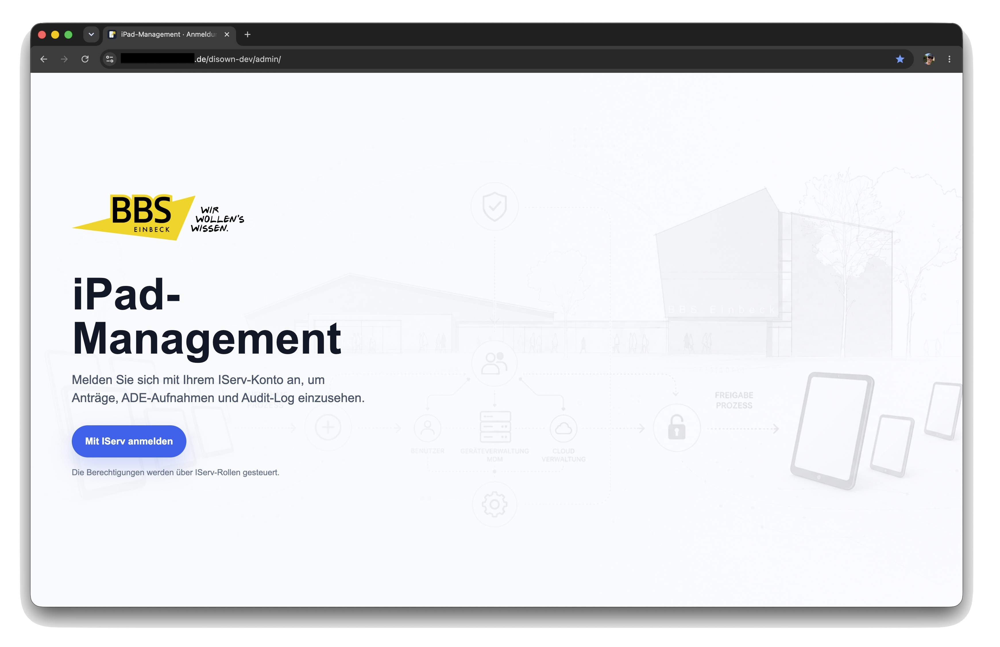
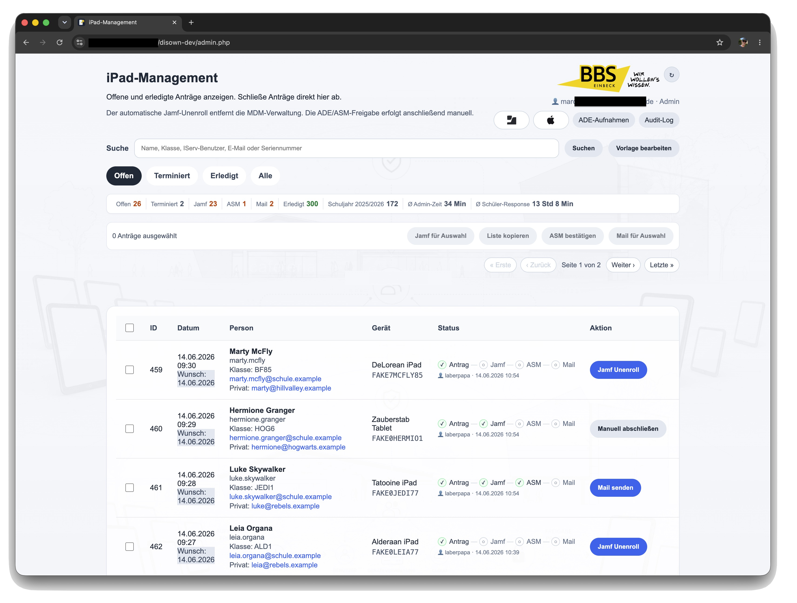
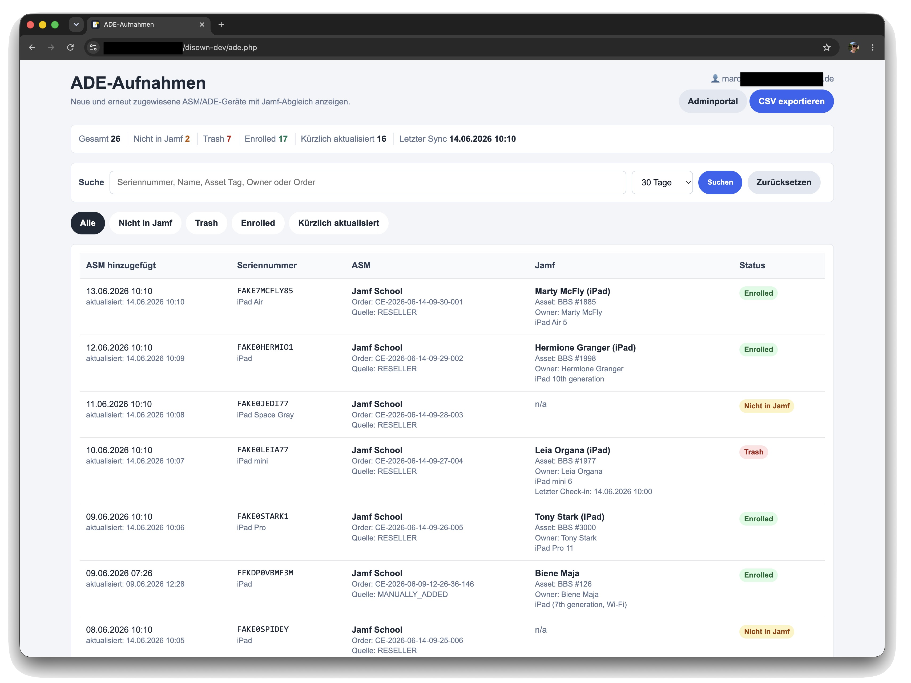
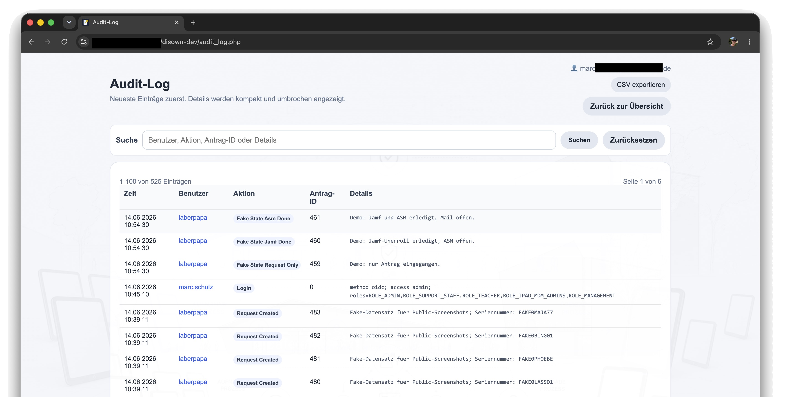
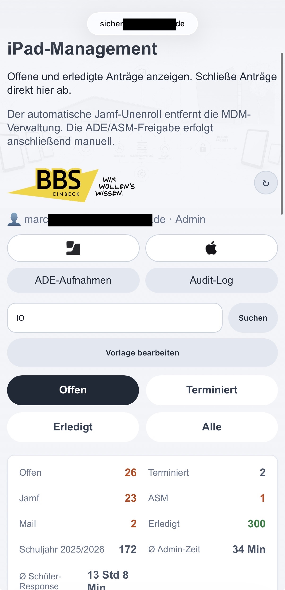
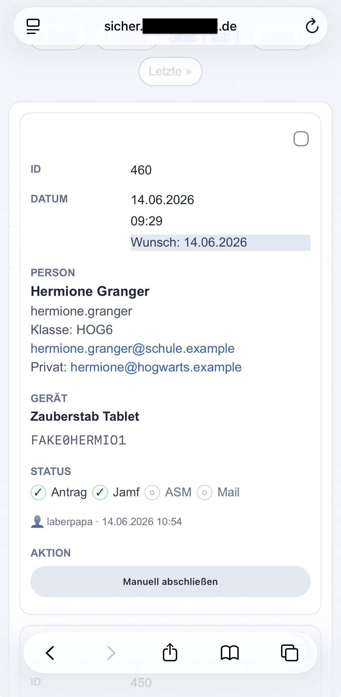
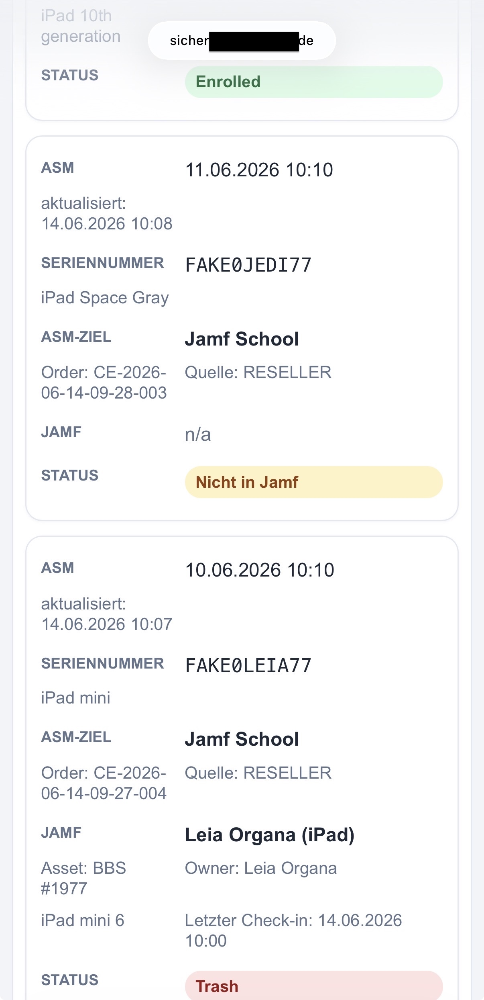

# BBS MDM Disown

[English README](README.en.md)

Webanwendung der BBS Einbeck fuer das iPad-Management rund um Freigabe, ADE-Aufnahmen, Jamf und Apple School Manager.

Die Anwendung bildet lokale MDM-Prozesse ab: Schuelerinnen und Schueler stellen ueber einen iPad-Webclip einen Freigabeantrag, das MDM-Team bearbeitet die Freigabe im Adminportal, prueft ADE-Aufnahmen und dokumentiert relevante Schritte nachvollziehbar.

## Screenshots

### Desktop









### Mobile-View

<p>
  
  
  
</p>

### WebClip auf dem iPad

<p>
  
  
  
</p>

## WebClip / Schuelerseite

Der Einstieg fuer Schuelerinnen und Schueler ist ein iPad-WebClip. Fuer den normalen Betrieb wird ein gemeinsamer WebClip fuer alle Geraete verwendet; die Seriennummer wird durch Jamf/MDM als Variable eingesetzt.

Produktiv:

```text
https://example.org/disown/?serial=%SerialNumber%
```

DEV/Test:

```text
https://example.org/disown-dev/?serial=%SerialNumber%
```

Die optionale Token-Funktion in `config/app.example.conf` ist fuer Spezialfaelle vorbereitet. Im Standardbetrieb bleibt `REQUIRE_SERIAL_TOKEN=0`, damit ein einzelner massentauglicher WebClip funktioniert.

## Release-Stand

Aktueller dokumentierter Stand:

```text
Version 1.9
Stand: 9. Juli 2026
```

Wichtige Releases:

- 1.1: neuer fachlicher Workflow, private E-Mail, Klasse, Wunschdatum, editierbare Mail
- 1.2: Bulk-Verarbeitung fuer Jamf, ASM und Mail
- 1.3: terminierte Antraege und Admin-Benachrichtigung per Cron
- 1.4: IServ-OIDC fuer Adminbereich, Auth-Audit-Events und Favicon
- 1.5: ADE-Aufnahmen mit ASM/Jamf-Abgleich, Filtern, CSV-Export und Cron-Sync
- 1.6: Login-Landingpage, iPad-Management-Portalname und Nur-Lesen-Rolle
- 1.7: mobile Darstellung fuer Admin, ADE-Aufnahmen und Audit-Log verbessert, inklusive polierter Mobile-Mini-Kacheln fuer Antraege
- 1.8: KUK-Geraete als Jamf-only Leseseite mit lokalem Sync, Owner-Historie, Problemgeraete-Ansicht, lokalen Mail-Kontaktmarkern und Jamf-Lizenzschaetzung im Adminportal
- 1.9: Admin-Dashboard mit 12-Monats-Antragsuebersicht, Jamf-Lizenzstatus, lokalen Klaerfaellen inklusive Mehrfachauswahl/Loeschen, Audit-Dashboard-Korrekturen und vereinheitlichtem Button-/Navigationsdesign fuer Admin, ADE, KUK und Audit-Log

## Funktionsumfang

- Antrag per Seriennummer aus dem iPad-Webclip
- Jamf-Abfrage anhand der Seriennummer
- Warnhinweis mit Pflichtbestaetigung vor Antragstellung
- Pflichtfeld fuer Klasse, maximal sechs Zeichen
- optionales privates E-Mail-Feld
- Wunschdatum fuer die Freigabe, keine Auswahl in der Vergangenheit
- Duplikatschutz fuer offene Antraege je Seriennummer
- Adminportal mit Suche, Filtern und Prozessanzeige
- Adminportal mit kompakter Jamf-Lizenzschaetzung aus lokaler Baseline und Jamf-Trash-Abgleich
- lokale Klaerfaelle fuer auffaellige Geraete oder offene Nachpruefungen, inklusive Filter, Zeilenklick, Mehrfachfaellen je Seriennummer, Notiz, Abschlussdokumentation und Loeschen versehentlich angelegter Faelle
- Login-Landingpage fuer den IServ/OIDC-Login
- getrennte Admin- und Nur-Lesen-Rollen
- Workflow: Antrag -> Jamf -> ASM -> Mail -> Erledigt
- Jamf-Unenroll ueber API
- manuelle ASM/ADE-Bestaetigung
- Mailvorschau mit editierbarem Empfaenger, Betreff und Nachricht
- Versand an schulische und/oder private E-Mail-Adresse
- Bulk-Verarbeitung fuer Jamf, ASM und Mail
- ASM-Seriennummernliste zum Kopieren
- Filter fuer offene, erledigte und terminierte Antraege
- responsive Mobile-Ansicht mit kompakten Mini-Kacheln fuer Antraege
- Audit-Log mit CSV-Export
- Admin-Benachrichtigung per Cron fuer faellige und terminierte Antraege
- ADE-Aufnahmen als eigene Leseseite mit ASM/Jamf-Abgleich, Suche, Filtern und CSV-Export
- automatischer ADE-Sync per Cron fuer DEV und PROD
- KUK-Geraete als eigene Jamf-only Leseseite mit Suche, Filtern, CSV-Export, Problemgeraete-Ansicht und lokalem Sync
- lokale Owner-Historie fuer KUK-Geraete ab KUK-Start
- lokale Kontaktmarker fuer KUK-Inaktivitaets- und iOS-Hinweismails, ohne Jamf zu veraendern
- DEV-Modus fuer Tests ohne echte Jamf- und Mail-Auswirkungen

## Produktivsystem

Produktivpfad:

```text
/var/www/example.org/disown
```

Produktiv-URL:

```text
https://example.org/disown/
```

Wichtige Pfade:

```text
/disown/          Antrag/Webclip
/disown/admin    Adminportal
/disown/audit    Audit-Log
/disown/ade.php  ADE-Aufnahmen
/disown/kuk.php  KUK-Geraete
/disown/logout.php
```

Das Projekt laeuft unter Apache/PHP und nutzt MySQL/MariaDB ueber `mysqli`.

## Entwicklungssystem

DEV-Pfad:

```text
/var/www/example.org/disown-dev
```

DEV-URL:

```text
https://example.org/disown-dev/
```

Der DEV-Modus wird im Code ueber den Ordnernamen `disown-dev` erkannt. Im DEV-Modus werden sicherheitskritische Aktionen simuliert, zum Beispiel Jamf-Unenroll und Mailversand.

## Workflow

### 1. Antrag

Der Antrag wird ueber `index.php` erfasst. Die Seriennummer wird typischerweise durch den iPad-Webclip als URL-Parameter uebergeben.

Vor dem Absenden muss der Hinweis bestaetigt werden, dass schulische Apps, Profile und Einstellungen entfernt werden koennen und vorher eigene Datensicherung noetig ist.

Erfasst werden:

- IServ-Benutzer
- schulische E-Mail
- Geraetename
- Seriennummer
- Klasse
- gewuenschtes Freigabedatum
- optional private E-Mail-Adresse

### 2. Jamf

Im Adminportal wird der Jamf-Unenroll einzeln oder per Bulk-Aktion ausgefuehrt. Die Jamf-Integration liegt in:

```text
jamf.php
```

Nach erfolgreichem Jamf-Unenroll bleibt der Antrag offen und wartet auf ASM.

### 3. ASM/ADE

Die ASM/ADE-Freigabe erfolgt bewusst manuell in Apple School Manager. Das Adminportal stellt dafuer eine kopierbare Seriennummernliste bereit.

Nach der Freigabe wird ASM im Adminportal bestaetigt. Erst danach wird der Mail-Schritt verfuegbar.

### 4. Mail

Nach ASM kann die Abschlussmail versendet werden. Der Maildialog erlaubt:

- Auswahl schulische E-Mail
- Auswahl private E-Mail, falls vorhanden
- manuelles Anpassen der Empfaenger
- manuelles Anpassen von Betreff und Mailtext

Erst nach erfolgreichem Mailversand wird der Antrag als erledigt markiert.

## Statuslogik

Der fachliche Zielprozess ist:

```text
Antrag
-> Jamf Unenroll
-> ASM manuell bestaetigt
-> Mail versendet
-> Erledigt
```

Wichtige Felder in `requests`:

```text
jamf_unenrolled
jamf_unenrolled_at
asm_manual_done
asm_manual_done_at
mail_sent
mail_sent_at
status
completed_at
completed_by
private_email
class_name
requested_release_date
```

`status='erledigt'` wird erst gesetzt, wenn die Mail erfolgreich versendet wurde.

## Bulk-Verarbeitung

Das Adminportal bietet eine Massenverarbeitung fuer gleichartige offene Schritte.

Unterstuetzte Bulk-Aktionen:

- Jamf fuer Auswahl
- ASM-Liste kopieren
- ASM bestaetigen
- Mail fuer Auswahl

Die Buttons werden passend zum naechsten offenen Schritt aktiviert. Gemischte Auswahlen werden nicht als falscher Prozessschritt verarbeitet.

Nach Bulk-Jamf wird eine kommagetrennte Seriennummernliste fuer ASM angezeigt. Die Liste kann in Apple School Manager zur Geraetesuche genutzt werden.

## Installation

Ausfuehrliche Installationshinweise:

```text
docs/INSTALL.md
```

Fuer eine neue Installation gibt es zwei Helfer:

```text
scripts/install.sh              erzeugt lokale Beispielkonfigurationen
scripts/check_requirements.php  prueft PHP, Extensions, Config und Datenbank
```

PHP-Abhaengigkeiten werden ueber Composer installiert:

```bash
composer install --no-dev --optimize-autoloader
```

`vendor/` ist bewusst nicht im Repository versioniert.

## Terminierte Antraege

Schuelerinnen und Schueler koennen ein gewuenschtes Freigabedatum angeben.

Im Adminportal werden Antraege mit zukuenftigem Wunschdatum getrennt als terminiert angezeigt. Faellige Antraege werden im normalen offenen Workflow verarbeitet.

## Admin-Benachrichtigung

Das Skript `notify_admins.php` informiert Admins per Mail ueber heute faellige Antraege.
Terminierte Antraege fuer spaeter loesen allein keine Mail aus; sie werden nur als Zusatzinfo angezeigt, wenn es faellige Antraege gibt.

Beispiel-Cron:

```cron
30 7,13 * * 1-5 /usr/bin/php /var/www/example.org/disown/notify_admins.php >> /var/log/disown-notify.log 2>&1
```

Das Skript sendet nur bei faelligen Antraegen und nur bei Aenderungen seit der letzten Benachrichtigung.

Nuetzliche Optionen:

```bash
php notify_admins.php --preview
php notify_admins.php --test-mail
php notify_admins.php --mark-current
php notify_admins.php --force
```

Die Benachrichtigung veraendert keine Antraege. Jamf, ASM und Mail bleiben Aktionen im Adminportal.

## ADE-Aufnahmen

Die Seite `ade.php` zeigt Geraete, die in Apple School Manager/ADE aufgenommen oder kuerzlich aktualisiert wurden. Sie ist eine reine Leseseite fuer Admins und veraendert keine Geraete und keine Antraege.

Die Daten werden aus zwei Quellen zusammengefuehrt:

- Apple School Manager: Seriennummer, Hinzufuegedatum, Aktualisierungsdatum, Modell, Bestellnummer, MDM-Zuweisung
- Jamf School: Geraetename, Asset Tag, Owner, Modell, Enrollment-/Trash-Status

Die Seite bietet:

- Suche nach Seriennummer, Name, Asset Tag, Owner oder Order
- Filter fuer alle, nicht in Jamf, Trash, enrolled und kuerzlich aktualisiert
- Zeitraumfilter fuer 7, 30, 90, 365 Tage oder alle Daten
- CSV-Export

Der Sync laeuft per CLI-Skript:

```bash
php sync_ade_enrollments.php --days=90
```

Beispiel fuer zeitversetzte Cronjobs in DEV und PROD:

```cron
17 7,13 * * * webuser /usr/bin/php /var/www/example.org/disown-dev/sync_ade_enrollments.php --days=90 >> /var/log/disown/ade-sync-dev.log 2>&1
29 7,13 * * * webuser /usr/bin/php /var/www/example.org/disown/sync_ade_enrollments.php --days=90 >> /var/log/disown/ade-sync-prod.log 2>&1
```

Der ADE-Sync liest ASM/Jamf und schreibt nur in die lokale Tabelle `ade_enrollments`.

## KUK-Geraete

Die Seite `kuk.php` zeigt Kolleginnen-/Kollegen-iPads aus Jamf School. Jamf ist die einzige Datenquelle; Apple School Manager wird fuer diese Ansicht nicht abgefragt.

Ein Geraet wird aufgenommen, wenn mindestens eine Bedingung zutrifft:

- Asset-Tag beginnt mit `LK-`
- Jamf-Gruppe ist exakt `LK - Leihgeräte`

Geraete ohne Owner werden bewusst angezeigt. Die Seite bietet Suche, Filter, Pagination mit 25 Eintraegen pro Seite und CSV-Export. Admins und Viewer duerfen ansehen, filtern und exportieren. Der manuelle Sync-Button schreibt nur in die lokalen Tabellen und veraendert keine Jamf-Geraete; er ist fuer schreibberechtigte Admins vorgesehen.

Lokale Tabellen:

- `device_cases`: lokale Klaerfaelle und Abschlussnotizen fuer auffaellige Geraete im Adminportal, mehrere Faelle je Seriennummer moeglich
- `kuk_devices`: aktueller Jamf-Stand der KUK-Geraete
- `kuk_owner_history`: lokale Owner-Historie ab KUK-Start aus Sync-Veraenderungen
- `kuk_device_workflow`: lokale Zeitstempel fuer versendete Inaktivitaets- und iOS-Hinweismails

Die KUK-Seite bietet operative Filter fuer alle Geraete, aelteste iOS-Versionen, fehlende Owner, aelteste Check-ins und Problemgeraete. In den iOS- und Check-in-Ansichten kann eine Mailvorschau erzeugt werden. DEV simuliert den Versand; PROD versendet per SMTP. Die Mailmarker bleiben lokal und schreiben nicht nach Jamf.

Der Sync laeuft per CLI-Skript:

```bash
php sync_kuk_devices.php
```

Beispiel fuer den taeglichen DEV-Cronjob:

```cron
43 6 * * * webuser /usr/bin/php /var/www/example.org/disown-dev/sync_kuk_devices.php >> /var/log/disown/kuk-sync-dev.log 2>&1
```

Der KUK-Sync liest Jamf und schreibt nur in die lokalen Tabellen `kuk_devices`, `kuk_owner_history` und `kuk_device_workflow`.

## Konfiguration

Sensible Konfiguration liegt ausserhalb des Webroots.

### Datenbank

Die lokale Datei `db.php` enthaelt die Datenbankverbindung und wird nicht versioniert.

### Jamf

Pfad:

```text
/etc/disown/jamf.conf
```

Beispiel:

```ini
JAMF_URL=...
JAMF_NETWORK_ID=...
JAMF_API_KEY=...
```

### Mail

Pfad:

```text
/etc/disown/mail.conf
```

Die Anwendung nutzt PHPMailer.

### Notify

Pfad:

```text
/etc/disown/notify.conf
```

Beispiel im Repository:

```text
config/notify.example.conf
```

### Apple School Manager API

Pfad:

```text
/etc/disown/asm.conf
```

Der private Schluessel fuer die Apple School Manager API liegt ausserhalb des Webroots. Die Anwendung nutzt ihn nur fuer den lesenden ADE-Sync.

### IServ OpenID Connect

Der Adminbereich kann ueber IServ/OpenID Connect abgesichert werden. In der
Produktionsumgebung ist OIDC fuer Adminportal, ADE-Aufnahmen und Audit-Log vorgesehen.

IServ-Issuer:

```text
https://mein-iserv.de
```

Redirect URIs fuer den IServ-SSO-Client:

```text
https://example.org/disown/oidc_callback.php
https://example.org/disown-dev/oidc_callback.php
```

Empfohlene Scopes:

```text
openid email profile iserv:roles iserv:uuid
```

Empfohlener Grant Type:

```text
Authorization code
```

OIDC-Konfiguration liegt ausserhalb des Webroots:

```text
/etc/disown/oidc.conf
/etc/disown/oidc-dev.conf
```

Beispiel im Repository:

```text
config/oidc.example.conf
```

Der Client Secret darf nicht ins Repository. Fuer DEV und PROD koennen
getrennte Konfigurationsdateien genutzt werden, damit OIDC zuerst im
Entwicklungssystem getestet werden kann.

Die Anwendung prueft das OIDC `id_token` gegen die vom IServ veroeffentlichte
`jwks_uri`. Der Provider muss signierte ID Tokens mit `RS256` und eine
OpenID-Connect-Metadatenantwort unter `/.well-known/openid-configuration`
bereitstellen.

Der OIDC-Login unterstuetzt zwei Berechtigungsstufen:

- Admin-Rolle: darf Jamf-, ASM-, Mail-, Bulk- und Vorlagenaktionen ausfuehren
- Viewer-Rolle: darf Adminportal, ADE-Aufnahmen und Audit-Log nur lesen, filtern und exportieren

Beispielrollen:

```text
OIDC_ALLOWED_ROLES="MDM_ADMINS,ROLE_MDM_ADMINS"
OIDC_VIEWER_ROLES="MDM_VIEWERS"
```

IServ liefert Rollen im Token je nach Kontext auch mit `ROLE_`-Praefix.
Deshalb sollte die Admin- bzw. Viewer-Rolle bei Bedarf in beiden Formen
hinterlegt werden.

## Sicherheit

- Adminportal und Audit-Log sind per IServ OpenID Connect geschuetzt.
- OIDC `id_token`-Signaturen werden per IServ-JWKS und `RS256` geprueft.
- Schreibaktionen werden bei Nur-Lesen-Benutzern serverseitig blockiert.
- DEV und PROD koennen getrennte OIDC-Konfigurationen nutzen.
- Apache Basic Auth kann als Fallback/Altbetrieb dienen, ist aber nicht der aktuelle Zielbetrieb.
- PHP protokolliert erfolgreiche Logins, abgelehnte Logins, Login-Fehler und Logout-Ereignisse im Audit-Log.
- Admin-POST-Aktionen nutzen CSRF-Pruefung.
- Datenbankzugriffe mit Eingaben nutzen Prepared Statements.
- HTML-Ausgaben werden escaped.
- Jamf-, Mail-, Notify-, ASM- und OIDC-Konfiguration liegen ausserhalb des Webroots.
- `db.php`, SQL-Dumps und Backups werden nicht versioniert.
- Audit-Log dokumentiert Adminaktionen.
- Linux-Dateirechte und ACLs koennen zusaetzlich lokale Benutzer aus dem Projekt ausschliessen.

Wichtig fuer ein oeffentliches Repository:

- keine echten Zugangsdaten committen
- keine echten Schuelerdaten oder Seriennummern in Screenshots zeigen
- Beispielkonfigurationen anonym halten
- Git-Historie vor Veroeffentlichung auf Secrets pruefen

## Audit-Log

Das Audit-Log speichert relevante Adminaktionen in der Tabelle:

```text
request_audit_log
```

Typische Aktionen:

- `JAMF_UNENROLL_SUCCESS`
- `JAMF_UNENROLL_FAILED`
- `ASM_MANUAL_DONE`
- `MAIL_SENT`
- `MAIL_FAILED`
- `TEMPLATE_UPDATED`
- `AUTH_LOGIN_SUCCESS`
- `AUTH_LOGIN_DENIED`
- `AUTH_LOGIN_ERROR`
- `AUTH_LOGOUT`
- Bulk-Aktionen

Die Audit-Seite bietet Filter und CSV-Export.

## Backup

Vor produktiven Aenderungen sollte ein Backup erstellt werden.

Auf dem Server wird dafuer ein Backup-Skript genutzt:

```bash
backup-disown.sh
```

Das Skript erstellt:

- Code-Archiv ohne `vendor` und `.git`
- Datenbankdump

Backups liegen ausserhalb des Webroots.

## Git-Workflow

Empfohlener Ablauf:

```bash
git status
git pull
```

Vor produktivem Deploy:

```bash
php -l index.php
php -l admin.php
php -l audit_log.php
php -l ade.php
php -l ade_api.php
php -l jamf.php
php -l notify_admins.php
php -l sync_ade_enrollments.php
php -l logout.php
```

Danach:

```bash
git diff
git add <dateien>
git commit -m "Kurze Beschreibung"
git push
```

## Projektdateien

Wichtige Dateien:

```text
index.php                         Schueler-Webclip und Antrag
admin.php                         Adminportal
audit_log.php                     Audit-Log
ade.php                           ADE-Aufnahmen
ade_api.php                       ASM/Jamf-Helfer fuer ADE-Aufnahmen
kuk.php                           KUK-Geraete
kuk_api.php                       Jamf-Helfer fuer KUK-Geraete
jamf.php                          Jamf-API-Integration
notify_admins.php                 Admin-Benachrichtigung
sync_ade_enrollments.php          CLI-Sync fuer ADE-Aufnahmen
sync_kuk_devices.php              CLI-Sync fuer KUK-Geraete
auth.php                          Authentifizierung und OIDC-Helfer
oidc_callback.php                 OIDC-Callback
logout.php                        Logout-Seite
templates/mail_release.txt        Mailvorlage
config/notify.example.conf        Beispiel fuer Notify-Konfiguration
config/oidc.example.conf          Beispiel fuer OIDC-Konfiguration
config/db.example.conf            Beispiel fuer Datenbank-Konfiguration
config/app.example.conf           Beispiel fuer App-/WebClip-Token-Konfiguration
config/mail.example.conf          Beispiel fuer SMTP-Konfiguration
config/jamf.example.conf          Beispiel fuer Jamf-Konfiguration
config/asm.example.conf           Beispiel fuer ASM-Konfiguration
docs/INSTALL.md                   Installationsanleitung
scripts/install.sh                interaktiver Setup-Helfer ohne /etc-Schreibzugriff
scripts/check_requirements.php    Installations- und Laufzeitcheck
scripts/generate_webclip_token.php WebClip-Token fuer Seriennummer erzeugen
images/                           anonymisierte Screenshots
```

## Hinweise zum Betrieb

Diese Anwendung verarbeitet personenbezogene Daten und Geraeteinformationen. Zugriff, Backups, Screenshots und CSV-Exporte muessen entsprechend sorgfaeltig behandelt werden.

CSV-Dateien aus Admin- und Audit-Exporten sollten nicht ungeschuetzt weitergegeben oder im Webroot abgelegt werden.
