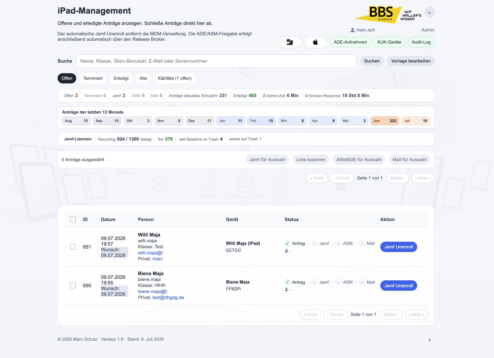
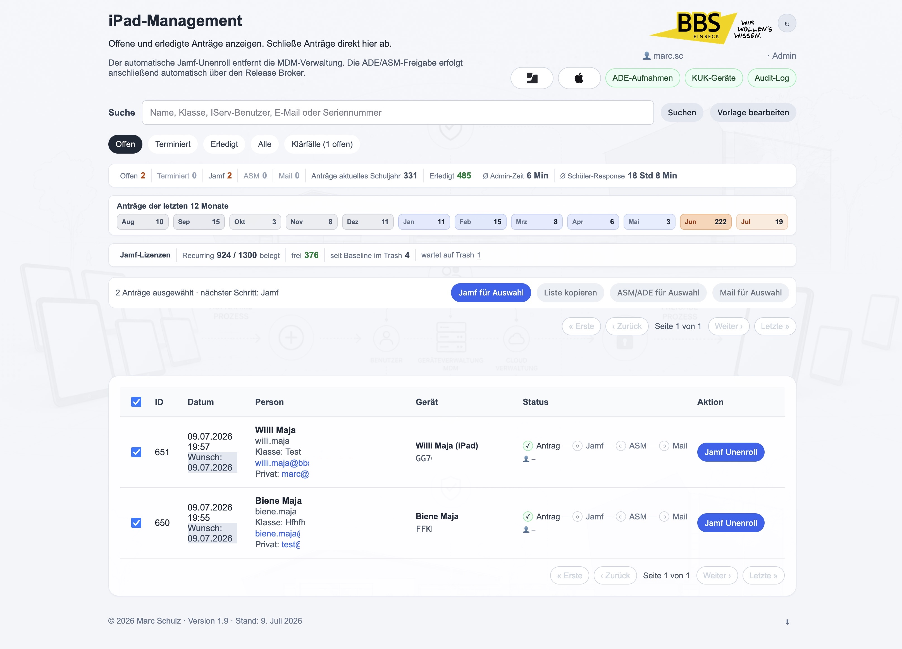
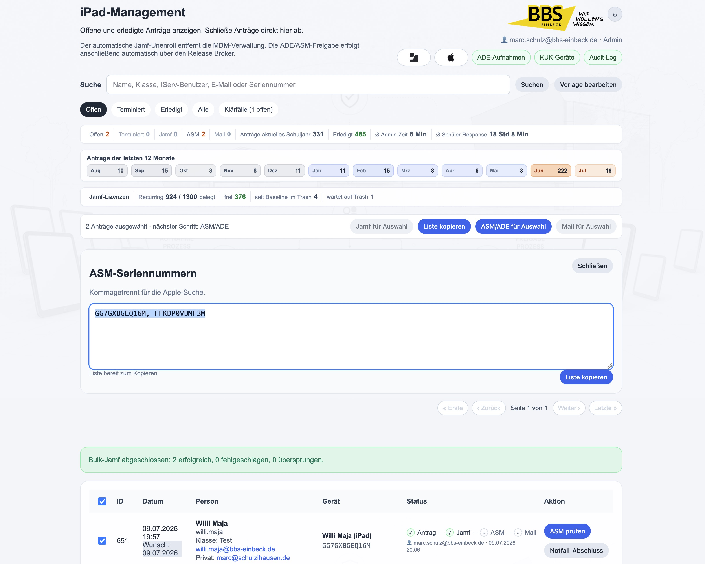
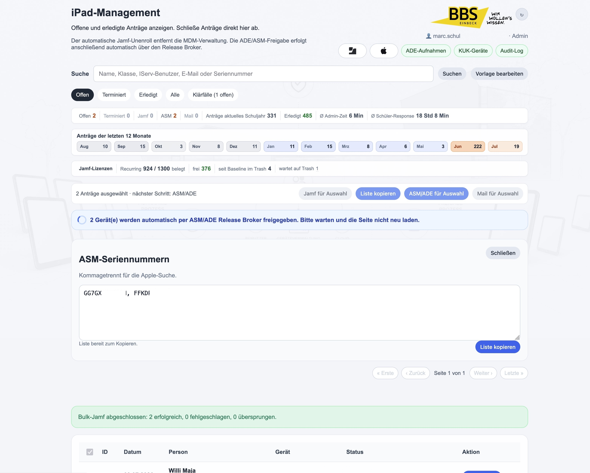
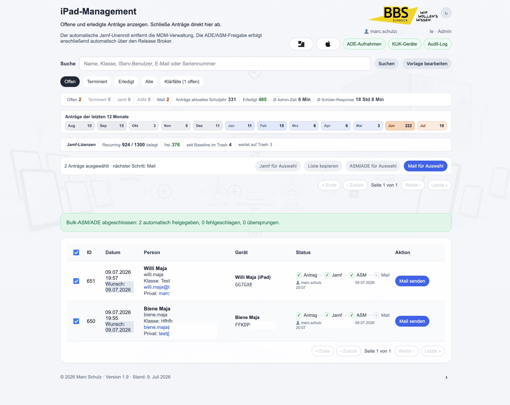

# BBS Einbeck iPad-Management

Webanwendung fuer die Rueckgabe und Freigabe ehemaliger Schueler-iPads der BBS Einbeck. Version 2.0 automatisiert den Ablauf bis zur Apple-ADE/ASM-Freigabe ueber einen lokalen Release Broker.

## Stand

- Version: `2.0`
- Datum: `9. Juli 2026`
- Produktionspfad: `/var/www/example.org/disown`
- Entwicklungszweig: `/var/www/example.org/disown-dev`
- Public-Demo: neutralisierte Variante ohne Zugangsdaten und ohne lokale Projekt-State-Dateien

## Funktionsumfang

- Self-Service-Webclip fuer Rueckgabeantraege.
- Schutzseite fuer schulische Leih-/Koffergeraete, damit diese nicht versehentlich freigegeben werden.
- Adminportal mit Suche, Statusfiltern, Bulk-Verarbeitung, Kennzahlen, Jahresverlauf und Jamf-Lizenztrend.
- Automatischer Jamf-Unenroll per Jamf-School-API.
- Automatische ASM/ADE-Freigabe per Apple School Manager Public API und lokalem NanoDEP Release Broker.
- Abschlussmail an schulische und private E-Mail-Adresse; der Prozess wird auch bei Teilfehlern abgeschlossen und der Mailstatus wird rot markiert.
- Klärfall-Notizen zu einzelnen Geraeten, lokal in der Datenbank.
- KUK-Geraeteuebersicht fuer Kolleginnen-/Kollegen-iPads aus Jamf School.
- ADE-Aufnahmen mit Abgleich zwischen ASM/ADE und Jamf School.
- Audit-Log mit Dashboard, Export und protokollierten Bulk-Seriennummernlisten.
- DEV-Modus mit Demo-Daten und Dry-Run fuer Jamf, ASM/ADE und Mail.

## Screenshots

## Standardablauf

1. Schuelerin oder Schueler stellt den Antrag ueber den Webclip.
2. Admin fuehrt den Jamf-Unenroll aus.
3. Das System weist genau dieses Geraet per ASM Public API dem Release Broker zu.
4. Der lokale NanoDEP Release Broker fuehrt den ADE/DEP-Disown aus.
5. Das System kontrolliert, dass das Geraet danach fuer den Broker nicht mehr erreichbar ist.
6. Abschlussmail wird an alle vorhandenen Empfaengeradressen gesendet.
7. Der Antrag ist erledigt; Teilerfolge und Fehler stehen im Audit-Log.

Die alte Spalte `asm_manual_done` bleibt aus Kompatibilitaetsgruenden bestehen, bedeutet ab Version 2.0 aber: ASM/ADE-Freigabe wurde erledigt, in der Regel automatisch.

## Bulk-Workflow

Der Bulk-Ablauf bleibt bewusst schrittweise:

1. Antraege markieren.
2. `Jamf fuer Auswahl` ausfuehren.
3. Seriennummernliste wird kopierbar angezeigt und im Audit-Log protokolliert.
4. `ASM/ADE fuer Auswahl` automatisiert die Apple-Freigabe ueber den Release Broker.
5. `Mail fuer Auswahl` sendet die vorbereiteten Abschlussmails.

Die Auswahl bleibt bis zum Mail-Schritt erhalten. Erst nach dem Mailversand wird automatisch abgewählt. Das verhindert, dass Admins nach dem Jamf-Schritt Seriennummern oder Empfaenger vergessen.

## ASM/ADE Release Broker

Version 2.0 nutzt zwei getrennte Apple-Wege:

- Apple School Manager Public API: weist ein einzelnes Geraet dem Release-Broker-MDM-Dienst zu.
- Apple ADE/DEP API ueber NanoDEP: fuehrt danach `disown` fuer dieses Geraet aus.

Wichtig:

- Die Freigabe aus der Apple-Organisation ist irreversibel.
- Der Broker lauscht nur lokal auf `127.0.0.1:9001`.
- Secrets liegen ausserhalb des Webroots unter `/srv/protected/asm-release-broker` und `/etc/disown`.
- DEV fuehrt nur Dry-Runs aus.

Die Beispielkonfiguration liegt unter:

- `config/asm-release-broker.example.conf`

Der Installationshelfer fuer den lokalen NanoDEP-Dienst liegt unter:

- `tools/install-nanodep-service.sh`

## Installation und Betrieb

Siehe:

- [Deutsch: docs/INSTALL.md](docs/INSTALL.md)
- [English: docs/INSTALL.en.md](docs/INSTALL.en.md)

Kurzfassung:

1. PHP/MySQL/Apache bereitstellen.
2. Datenbank und Tabellen anlegen.
3. Jamf-School-API konfigurieren.
4. Apple School Manager API Account konfigurieren.
5. Release Broker in ASM anlegen, Release erlauben und Token fuer NanoDEP importieren.
6. `tools/install-nanodep-service.sh` ausfuehren.
7. DEV Dry-Run und ein einzelnes PROD-Testgeraet pruefen.

## Wichtige Dateien

- `index.php` - Webclip und Antragserfassung.
- `admin.php` - Adminportal, Bulk-Workflow, Mail, Dashboard.
- `asm_release.php` - ASM/ADE-Freigabe ueber Release Broker.
- `jamf.php` - Jamf-School-Anbindung und Geraeteschutz.
- `ade.php` - ADE-Aufnahmen.
- `kuk/index.php` - KUK-Geraete.
- `audit_log.php` - Audit-Log und Auswertungen.
- `config/asm-release-broker.example.conf` - Beispiel fuer Broker-Konfiguration.
- `tools/install-nanodep-service.sh` - systemd-Installation des NanoDEP-Servers.

## Sicherheit

- Keine Secrets im Repository.
- Runtime-Konfiguration unter `/etc/disown`.
- Geschuetzte Token/Keys unter `/srv/protected`.
- Public-Repository ist neutralisiert.
- Schreibende Aktionen sind Admin-only.
- KUK-Seite ist read-only gegen Jamf.
- Alle kritischen Aktionen werden auditiert.

## Historie

- `2.0`: automatische ASM/ADE-Freigabe ueber Release Broker, NanoDEP-Dienst, verbesserter Bulk-Workflow, Mail an beide Adressen mit Teilerfolg, neue Doku und Screenshots.
- `1.9`: UI-Vereinheitlichung, Monatsuebersicht, Klärfaelle, Jamf-Lizenzindikator.
- `1.8`: KUK-Geraete, ADE-Aufnahmen, Audit-Dashboard.
